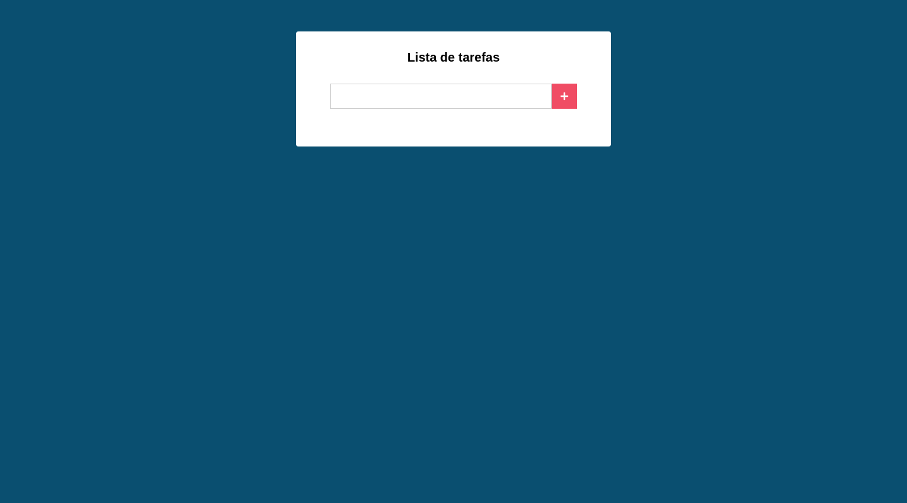
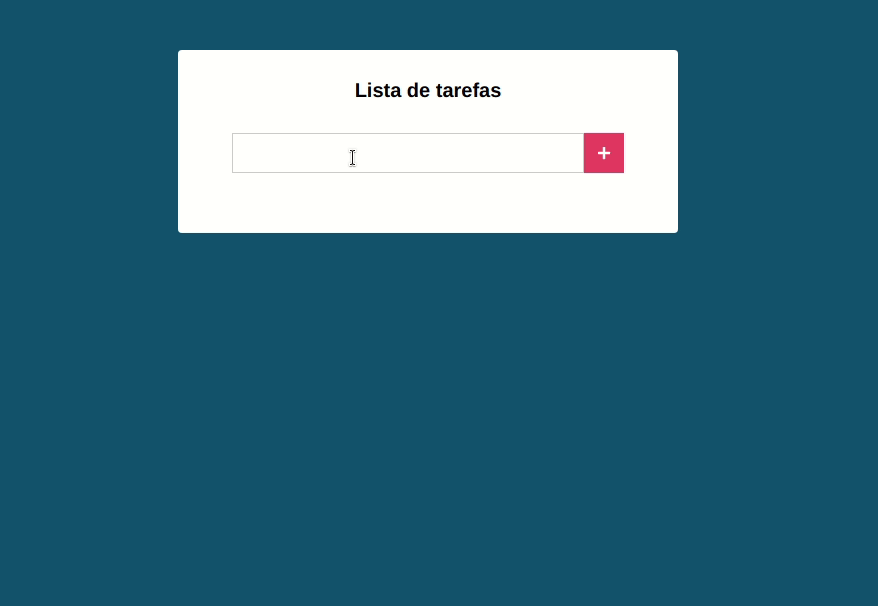

<p align="center">
  <image
  src="https://img.shields.io/github/languages/count/JCDMeira/react-class-app"
  />
  <image
  src="https://img.shields.io/github/languages/top/JCDMeira/react-class-app"
  />
  <image
  src="https://img.shields.io/github/last-commit/JCDMeira/react-class-app"
  />
  <image
  src="https://img.shields.io/github/watchers/JCDMeira/react-class-app?style=social"
  />
</p>

# 📋 Indíce

- [Proposta](#id01)
  <!-- - [O desafio](#id01.1)
    - [Requisitos não funcionais ](#id01.1.1)
    - [Requisitos não obrigatórios](#id01.1.2) -->
- [Screenshots](#id02)
- [Links](#id03)
  - [Recursos úteis](#id03.1)
- [Feito com](#id04)
  - [O que aprendi](#id04.1)
- [Pré-requisitos](#id05)
- [Procedimentos de instalação](#id06)
- [Autor](#id07)

# 🚀 Proposta <a name="id01"></a>

Criar uma aplicação com React usando os componentes baseados em classes.

<!-- ## :trophy: O desafio <a name="id01.1"></a>

### :dart: Requisitos não funcionais <a name="id01.1.1"></a>


### :pushpin: Requisitos não obrigatórios <a name="id01.1.2"></a>-->

# :camera_flash: Screenshots <a name="id02"></a>

<br />

## :iphone: Mobile design

<p  align="center">
  </img>
</p>

## :iphone: Tablets design

<p  align="center"></img></p>

## :desktop_computer: Desktop design

<p  align="center"></img></p>

## :chart_with_upwards_trend: result of my work

<p  align="center"></img></p>

<br />

# :heavy_check_mark: Links <a name="id03"></a>

<br />

- Insomnia for development: [Insomnia](https://insomnia.rest/download)

<br />

## Recursos úteis <a name="id03.1"></a>

- [Tutorial de react](https://pt-br.reactjs.org/tutorial/tutorial.html)
- [Conversor de unidades CSS - px para VH/VW/REM](https://it-news.pw/pxtovh/)
- [React hooks: o que é, porque usar e exemplos!](https://blog.betrybe.com/tecnologia/react-hooks/#2)
- [Componentes React: componentes de classe e funcional sem estado](https://blog.geekhunter.com.br/criando-componentes-react-componentes-de-classe-e-funcional-sem-estado/)
- [React.Component](https://pt-br.reactjs.org/docs/react-component.html)
- [O lado feio do React Hooks](https://oieduardorabelo.medium.com/o-lado-feio-do-react-hooks-c988524352d3)

# 🛠 Feito com <a name="id04"></a>

- [React](https://reactjs.org/)

## O que eu aprendi <a name="id04.1"></a>

# ☑️ Pré-requisitos <a name="id05"></a>

<br />

- [x] Editor de código de sua preferência (recomendado VS code)
- [x] Git
- [x] Gerenciador de pacotes Yarn ou NPM

<br />

# 📝 Procedimentos de instalação <a name="id06"></a>

<br />

Clone este repositório usando o comando:

```bash
git clone https://github.com/JCDMeira/react-class-app.git
```

Na pasta do projeto instale as dependências com uso do npm ou yarn

```bash
npm install

ou

yarn install
```

Para iniciar o servidor é só usar o comando

```
yarn start

ou

npm start

```

<br />

# :sunglasses: Autor <a name="id07"></a>

<br />

- Personal Page - [Jean Carlos De Meira](https://jcdmeira.github.io)
- Instagram - [@jean.meira10](https://www.instagram.com/jean.meira10/)
- GitHub - [JCDMeira](https://github.com/JCDMeira)
